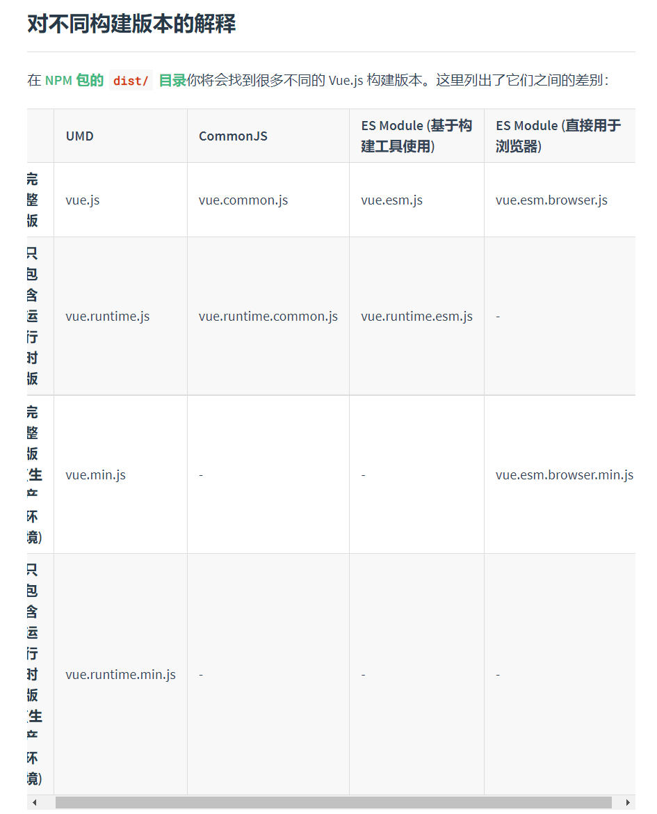
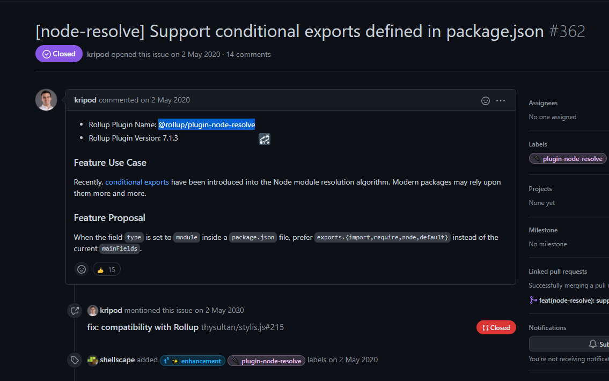

# 包入口

在日常开发中使用别人封装好的npm包是一件很常见的事情，工作中也会提炼自己经常重复性代码变成包分享给其他模块去使用。

当封装一个npm包时，就需要站在包使用者的角度去考虑如何设计你的npm包。

其中最重要的就是“入口”，因为使用你代码都会经过**import**或者其他方式被引用，从而读取到npm包里面的内容。

例如打包工具webpack或者rollup，他们会根据一定的规则去查找你的包入口。

例如，在代码里使用vue

```javascript
import Vue from 'vue'
```

## 准备工作

在vue官网的[安装章节](https://cn.vuejs.org/v2/guide/installation.html)，你会看到各式各样的构建版本，每一个版本都存放在指定的目录里。



那当你在项目里使用vue的时候，打包工具是如何知道它应该使用哪个版本的呢？

这里就需要搞清楚以下几点：

- 如何声明包的入口？
- 有哪些包入口的种类？
- 为什么会出现这些入口种类？
- 作为**包作者**，应该如何正确的声明它？
- 作为**包的使用者**，应该如何正确的使用它？

## 如何声明包的入口

npm包都会有一个包描述文件，它叫**package.json**，用来描述包的名称、描述、作者、依赖等元信息。

在最新的[package.json规范描述](https://docs.npmjs.com/cli/v7/configuring-npm/package-json#main)中，罗列了两个目前被npm官方收录的入口字段。
他们分别是:

- main
- browser
- module

当然，在社区中存在比较新的模块导出声明，例如：

- exports

具体的声明实例，可以参考vue官方仓库。

例如vue的package.json

```javascript
{
  "name": "vue",
  "version": "2.6.14",
  "description": "Reactive, component-oriented view layer for modern web interfaces.",
  "main": "dist/vue.runtime.common.js", // 入口文件
  "module": "dist/vue.runtime.esm.js", // es module入口文件
  "unpkg": "dist/vue.js", // unpkg.com读取的入口文件
  //...其他配置项
}
```

## 入口字段的种类

### main字段

以下是[官方文档的引用](https://docs.npmjs.com/cli/v7/configuring-npm/package-json#main)

> The main field is a module ID that is the primary entry point to your program. That is, if your package is named foo, and a user installs it, and then does require("foo"), then your main module's exports object will be returned.

> This should be a module relative to the root of your package folder.

> For most modules, it makes the most sense to have a main script and often not much else.

> If main is not set it defaults to index.js in the packages root folder.

翻译过来就是：

- main是程序的**主要入口**
- **main的值**，应该使用相对路径，相对于包的根目录。
- **默认main的值**，如果你没有指定main字段，将默认将根目录下的**index.js**作为入口文件

#### 历史渊源

main应该是最早前端模块化的产物，最早是和package.json一起出现的。

也就是node.js & npm出现的时候，是在2009年的时候，nodejs当时为了提升HTTP Server的并发数而产出的项目，而npm诞生于2010年，主要是为了分享nodejs的源码以及类库，而main字段就是作为当时nodejs模块的入口来使用。

随着大前端时代的到来，浏览器端的应用规模爆炸式增长，而当时es module还不是很成熟，早期大家使用的模块化规范还停留在amd，commonjs的模块化规范，也就是通常写的es5的代码，当时作为早起的客户端包管理工具bower。

后来npm开始出现客户端的类库，例如react，等等，npm也从最早的nodejs类库管理工具  -> javascript包管理工具

而早期es5的模块化下，main字段还是够用的。

### browser

它和**main**字段类似，它用于声明该包是被使用于浏览器，相当于变相提示用户，该包并不适用于非浏览器执行环境。

[官方文档](https://docs.npmjs.com/cli/v8/configuring-npm/package-json#browser)

### module

module为es module的入口指向。当当前包被es module引用时，包管理工具会优先根据此字段，去查找对应的模块。

它一般作为当前包的esm版本的导出。

### exports

exports 出现在nodejs v12.7.0版本中，引用[官方文档](https://nodejs.org/api/packages.html#nodejs-packagejson-field-definitions)：

> The "exports" field allows defining the entry points of a package when imported by name loaded either via a node_modules lookup or a self-reference to its own name. It is supported in Node.js 12+ as an alternative to the "main" that can support defining subpath exports and conditional exports while encapsulating internal unexported modules.

它设计目的：

- 替换main字段
- 定义包的多个入口，以备被import或者require使用
- 用于实现[Subpath exports](https://nodejs.org/api/packages.html#subpath-exports)
- 用于实现[Conditional exports](https://nodejs.org/api/packages.html#conditional-exports)，来区分不同环境下的导入


#### Conditional exports

它意味条件导出。因为nodejs的发展，nodejs也开始支持原生es module，但是又因为历史原因，仍大量存在commonjs的模块范式，commonjs模块范式使用require来导入模块。

为了兼容不同环境的使用，包设计者可以在package.json中声明不同包在不同模块范式下的使用方式。

例如: 

```javascript
// package.json
{
  "main": "./main-require.cjs",
  "exports": {
    "import": "./main-module.js",
    "require": "./main-require.cjs"
  },
  "type": "module"
}
```

根据以上定义可以推断出以下结论

- type: module，意思是该包使用的是nodejs原生的es module进行开发
- main 是为了兼容nodejs < 12的用户
- exports 是用来声明具体环境下的使用，仅限于nodejs > 12。
  - 当用户使用commonjs来requrie时，nodejs将会加载```./main-require.cjs```
  - 当用户使用es module来import时，nodejs将会加载```./main-require.js```

完整的说明文档，请参见官方[Conditional exports](https://nodejs.org/api/packages.html#conditional-exports)

#### Subpath exports

Subpath exports为子路径的快捷导出。

曾经使用某个包时，如果想要使用非main字段指定的文件时，需要满足两个条件

1. 包作者需要将源代码一起publish到npm仓库
2. 用户需要知道包的目录结构

例如，当你在使用element-ui进行业务开发时，忽然你发现你对element-ui的```el-scrollbar```组件感兴趣，你想要引用它，但是它并没出现在element-ui 显式exports中，然后你就会在自己的代码中写下如下代码

```js
import ElScrollbar from 'element-ui/packages/el-scrollbar';
```

这显然是不可靠的，原因有两点：

1. 如果有一天，作者改变了包的目录结构，你的代码就会开始大量报错，提示你包路径未找到
2. 如果有一天，作者删除了该组件，你的代码需要面临大面积重构，然而仓库作者并不需要承担什么，因为他们的确没有告诉你这个组件是提供给用户使用的！

而**Subpath exports**恰恰就是为了解决这一点，让包作者能够**显式**告诉你，哪些文件是**可用的**。

并且，它会缩短你引用某一个模块的**引用路径**

例如:

```json
{
  "main": "./main.js",
  "exports": {
    ".": "./main.js",
    "./submodule": "./src/submodule.js"
  }
}
```

用户可以通过如下代码使用**submodule.js**

```js
import submodule from 'es-module-package/submodule';
// Loads ./node_modules/es-module-package/src/submodule.js
```

当用户引用非显式导出的模块时，nodejs将会抛出一个错误

```js
import submodule from 'es-module-package/private-module.js';
// Throws ERR_PACKAGE_PATH_NOT_EXPORTED
```

## 作为包的作者，该如何声明？

如果你作为一个包的作者，你应该尽可能的满足你的用户，最大限度和努力兼容用户的使用环境。

对于我个人的总结，包在不同适用环境，可选和必选声明的字段如下

|         | 客户端                       | Nodejs                                                | 客户端&Nodejs (例如SSR场景) |
| ------- | ---------------------------- | ----------------------------------------------------- | --------------------------- |
| main    | 需要                         | 需要                                                  | 需要                        |
| browser | 需要                         | 不需要                                                | 需要                        |
| module  | 需要 (提供给打包工具优化) | 需要                                                  | 需要                        |
| exports | 可选                    | Nodejs < 12时，无需声明<br />Nodejs >= 12时，可选声明 | 可选                        |

## 作为包的使用者，如何正确使用?

### webpack的玩家

需要小心exports的支持情况，目前webpack5的支持情况见[文档](https://webpack.js.org/guides/package-exports/)

对于传统的browser，module，main，webpack有自己的解析优先级，如果要改变其优先级，参考resolve.mainFields配置，[文档](https://webpack.js.org/configuration/resolve/#resolvemainfields)

```js
module.exports = {
  //...
  resolve: {
    mainFields: ['browser', 'module', 'main'],
  },
};
```

### Rollup 或者 Vite玩家

对于exports, 目前已被实现于@rollup/plugin-node-resolve插件的 >= 7.1.3版本



对于其他browser，module，main的情景，优先级配置被实现于@rollup/plugin-node-resolve的配置项的[mainFields](https://github.com/rollup/plugins/tree/master/packages/node-resolve#mainfields)中。

## 参考资料

- [npm package.json 文档](https://docs.npmjs.com/cli/v7/configuring-npm/package-json)
- [package.json field definitions](https://nodejs.org/api/packages.html#nodejs-packagejson-field-definitions)
- [Node.JS (New) Package.json Exports Field](https://medium.com/swlh/npm-new-package-json-exports-field-1a7d1f489ccf)
- [Node.js Wiki百科](https://zh.wikipedia.org/wiki/Node.js)
