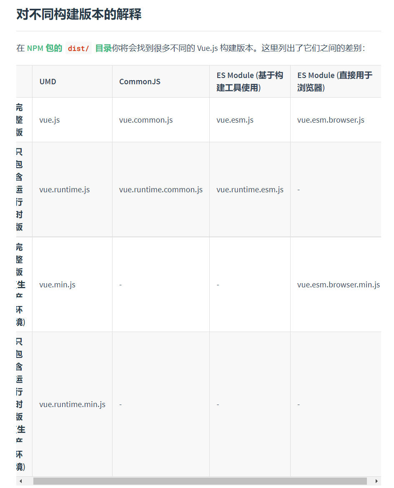

# 包入口

在日常开发中使用别人封装好的npm包是一件很常见的事情，工作中也会提炼自己经常重复性复制粘贴的代码变成包去分享给其他模块去使用。

当要去封装一个npm包时，就需要站在包使用者的角度去考虑如何设计你的npm包。

其中最重要的就是“入口”，因为使用你代码都会经过**import**，你的包，打包工具就会默认去根据一定的规则去查找对应的包入口，从而读取到npm包里面的内容。

这个

例如，最常见的就是vue的使用

```javascript
import Vue from 'vue'
```

在vue官网的[安装章节](https://cn.vuejs.org/v2/guide/installation.html)，你会看到各式各样的构建版本，每一个版本都存放在指定的目录里。



那当你在项目里使用vue的时候，打包工具是如何知道它应该使用哪个版本的呢？

这里就需要搞清楚以下几点：

- 如何声明包的入口？
- 有哪些包入口的种类？
- 为什么会出现这些入口种类？
- 作为**包作者**，应该如何正确的声明它？
- 作为**包的使用者**，应该如何正确的使用它？

## 本文目录

[[toc]]

## 如何声明包的入口

npm包都会有一个包描述文件，它叫**package.json**，用来描述包的名称、描述、作者、依赖等元信息。

在最新的[package.json规范描述](https://docs.npmjs.com/cli/v7/configuring-npm/package-json#main)中，罗列了两个目前被npm官方收录的入口字段。
他们分别是:

- main
- browser

当然，在社区中仍存在其他没有被官方收录的入口字段，例如：

- module
- exports

例如vue的package.json

```javascript
{
  "name": "vue",
  "version": "2.6.14",
  "description": "Reactive, component-oriented view layer for modern web interfaces.",
  "main": "dist/vue.runtime.common.js", // 入口文件
  "module": "dist/vue.runtime.esm.js", // es module入口文件
  "unpkg": "dist/vue.js", // unpkg.com读取的入口文件
  //...其他配置项
}
```

## 入口字段的种类

### main字段

以下是[官方文档的引用](https://docs.npmjs.com/cli/v7/configuring-npm/package-json#main)

> The main field is a module ID that is the primary entry point to your program. That is, if your package is named foo, and a user installs it, and then does require("foo"), then your main module's exports object will be returned.

> This should be a module relative to the root of your package folder.

> For most modules, it makes the most sense to have a main script and often not much else.

> If main is not set it defaults to index.js in the packages root folder.

翻译过来就是：

- main是程序的**主要入口**
- **main的值**，应该使用相对路径，相对于包的根目录。
- **默认main的值**，如果你没有指定main字段，将默认将根目录下的**index.js**作为入口文件

#### 历史渊源

main应该是最早前端模块化的产物，最早是和package.json一起出现的。

也就是node.js & npm出现的时候，是在2009年的时候，nodejs当时为了提升HTTP Server的并发数而产出的项目，而npm诞生于2010年，主要是为了分享nodejs的源码以及类库，而main字段就是作为当时nodejs模块的入口来使用。

随着大前端时代的到来，浏览器端的应用规模爆炸式增长，而当时es module还不是很成熟，早期大家使用的模块化规范还停留在amd，commonjs的模块化规范，也就是通常写的es5的代码，当时作为早起的客户端包管理工具bower。

后来npm开始出现客户端的类库，例如react，等等，npm也从最早的nodejs类库管理工具  -> javascript包管理工具

而早期es5的模块化下，main字段还是够用的。

### browser

### module

### exports

## 参考资料

- [npm package.json 文档](https://docs.npmjs.com/cli/v7/configuring-npm/package-json)
- [Node.JS (New) Package.json Exports Field](https://medium.com/swlh/npm-new-package-json-exports-field-1a7d1f489ccf)
- [Node.js Wiki百科](https://zh.wikipedia.org/wiki/Node.js)
