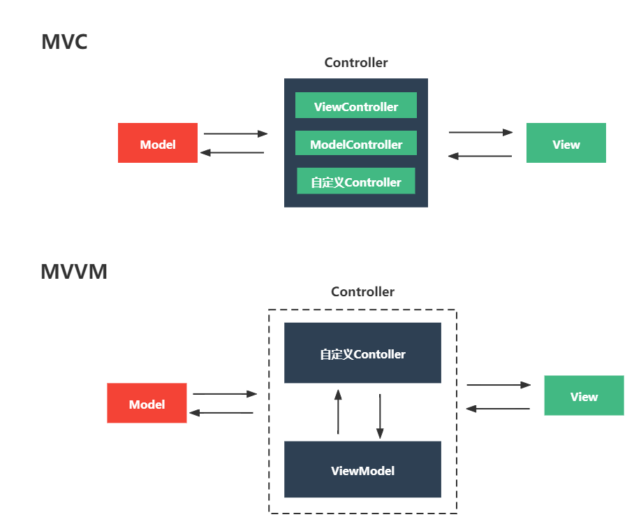
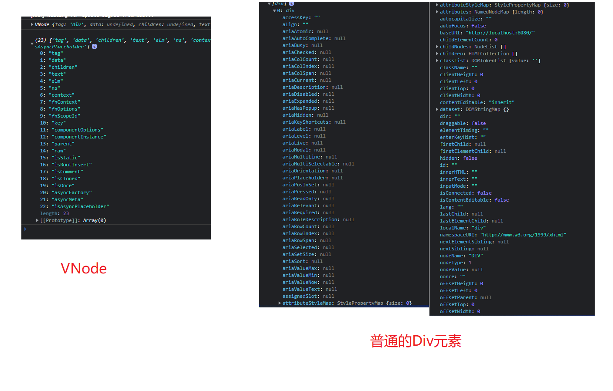
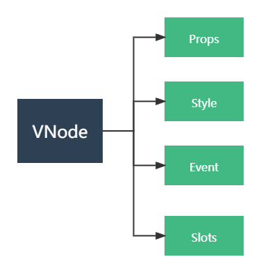

# 你不知道的Virtual DOM

[toc]

## 什么是Virtual DOM？

VNode全称Virtual DOM，叫虚拟DOM，是目前主流MVVM前端框架的组成部分。

最初诞生的目的是前端工程化解决方案中的一个技术点。

主要的职责如同**DOM元素一样**，用于**描述页面**的结构。

你可能会问，那为什么Vue，React等主流MVVM框架为什么不直接用DOM？

那就得知道Virtual DOM解决了什么问题。

## Virtual DOM解决了什么问题？

解决了目前阶段Web开发的工程化问题。

这就不得不提MVVM框架，Vue和React等等都是MVVM框架的实现。

回顾一下，历史阶段是如何开发一个页面的。

1. 获取数据：我们要从后端服务器拿到数据结构Model，然后保存到一个地方
2. 创建视图：可能使用模板引擎去描述我们的页面结构。
3. 渲染到视图：将Model结合模板引擎，获得新的页面结构片段.
4. 监听视图变化更新数据：监听DOM元素的事件，用户操作等，等待新的Model变更。
5. 将新的变化再一次渲染到视图：当用户操作页面后会得到新的Model，将Model根据相应的预设逻辑进行更新，并同步到视图中。
6. 提交到服务器：将新的Model更新到数据库。

而现阶段，使用MVVM框架是如何开发一个页面的呢？

1. 获取数据：我们要从后端服务器拿到数据结构Model，然后保存到一个地方
2. 描述视图：描述页面的结构(VNode or VNode Template)。
3. 绑定到视图：将Model丢给MVVM框架，由VM来维护视图和数据间的关系和变化。
4. 提交到服务器：将新的Model更新到数据库。

原来需要手动维护的**渲染到视图、监听视图变化更新数据、将新的变化再一次渲染到视图**，这三层关系，**由MVVM框架来统一托管**。



其中MVVM里的vm，最核心的就是使用Virtual DOM来维护页面。

那么为什么数据同步需要用到Virtual DOM？

**第一，它没有DOM Element那么重**

Diff性能高，VNode相当于阉割版的DOM Element，属性少，相比DOM Element，需要Diff的东西少。



**第二，增强了组件化的实现**

1. 提前尝鲜。VNode可以实现插槽(Slot)等Web Component里才有的前沿技术，并把它们搬到大多数浏览器上。
2. 提升代码可维护性，开发者能够在创建自己页面的时候，能够更佳直观的知道代码中的模块关系。

## Virtual DOM由哪些组成部分?

这里仅仅讨论Vue里的Virtual DOM实现，Virtual DOM由一个个VNode组成，VNode由以下几个部分组成

- 入参：Props和DOM Props和DOM Attrs
- 样式: class和style
- 事件: on和nativeOn
- 插槽: slot和scopedSlots

有了以上信息，就足够描述我们的页面了。



## 如何利用Virtual DOM？

### 实际编码的使用

**SFC(单文件组件)**

移除template元素，使用render函数代替

```vue
<script>
    // Vue组件
    export default {
        render(createElement) {
            // <div id="el"></div>
            return createElement(
                'div', 
                {
                    attrs: {
                        id: 'el'
                    }
                }, 
                ['I\'m a div']
            )
        }
    }
</script>

<script>
    // jsx版本
    export default {
        render() {
            // <div id="el"></div>
            return (
                <div id="el"></div>
            )
    }
</script>
```

**在js文件中**

VNode的创建和jsx其实也可以在普通的js文件中使用，只需要引用了vue的createElement函数即可

```jsx
/**
* 创建select元素
* @param {VueComponent.createElement} createElement
* @param {Array<{ label: string, value: string }>} options
* @example
* <select>
*  <option value="a"> A </option>
*  <option value="b"> B </option>
* </select>
*/
function genSelectVNode(createElement, options) {
    const optionsVNodeList = options.map(function ({ label, value }) {
        return createElement('option', { value }, label);
    });
    return createElement('select', optionsVNodeList);
}

/**
* 创建select元素
* @param {VueComponent.createElement} createElement
* @param {Array<{ label: string, value: string }>} options
* @example
* <select>
*  <option value="a"> A </option>
*  <option value="b"> B </option>
* </select>
*/
function genSelectVNodeForJSX(createElement, options) {
    const optionsVNodeList = options.map(function ({ label, value }) {
        return <option value={value}>{label}</option>
    });
    return <select>{optionsVNodeList}</select>
}
```

### 框架是如何将Virtual DOM转换成实际的DOM

.png)

1. render 根据Model创建新的Virtual DOM
2. diff, 找出两个tree之间的最小编辑距离
3. patch，打开一个缓冲区，将最小编辑距离存入缓冲区，待下一帧绘制前同步至页面

### 控制Diff算法

Vue采用的是双指针层级对比方法。具体的[代码实现的updateChildren函数](https://github.com/vuejs/vue/blob/dev/src/core/vdom/patch.js)

.png)

**判断是否两个节点是否相等**

```js
// 判断两个节点是否相同
function sameVnode (a, b) {
  return (
    a.key === b.key && // 优先使用key判断
    a.asyncFactory === b.asyncFactory && (
      (
        a.tag === b.tag &&
        a.isComment === b.isComment &&
        isDef(a.data) === isDef(b.data) &&
        sameInputType(a, b)
      ) || (
        isTrue(a.isAsyncPlaceholder) &&
        isUndef(b.asyncFactory.error)
      )
    )
  )
}

```

通过控制key值，可以实现

1. 控制DOM元素的复用，实现静态渲染
2. 强制刷新DOM元素

> 关于key的官方说明：https://cn.vuejs.org/v2/api/#key

## 适用场景及实战案例

### 场景1：函数式组件

函数式组件多适用于那些一次性业务场景，它属于临时性的执行，执行完即回收。

例如，创建一个Alert，用于提示用户的信息

```jsx
// MyAlert.js
import Vue from 'vue';

const ContainerStyles =  {
    width: '400px',
    height: '300px',
    position: 'fixed',
    left: '50%',
    top: '50%',
    transform: 'translate(-50%, -50%)'
}

function MyAlert(messageGenerator) {
    const MyAlertComponent = Vue.extend({
       name: 'MyAlert',
       render(createElement) {
           const content = messageGenerator(createElement);
           
           return (
               <div style={ContainerStyles}>{content}</div>
           )
       }
    })
    
    const alert = new MyAlertComponent();
    
    alert.$mount();
    
    document.body.append(alert.$el);
}

export default MyAlert;
```

调用方

````js
import MyAlert from './MyAlert.js';

MyAlert(function (createElement) {
    return createElement('p', {
        style: {
            color: 'red'
        }
    }, '测试')
});
````

### 场景2：设计灵活度更高的组件

- 高度配置化的组件（举例，TypeDataTable的设计)
- 改良原有的代码设计，提升可维护性，可读性，高度模块化。（举例，TypeDataTable的设计)
- 实现一些只有javascript才能实现特殊渲染逻辑。(举例，DataTable的高级检索)

### 场景3：组件的单元测试

- 脱离浏览器环境进行组件本身的逻辑测试，分支测试，语句测试等单元级别的测试。
- 代码少，速度快，在大量测试用例下，能够节省CI资源的消耗。

### 场景4：服务器端渲染

- 需要良好的SEO
- 降低维护成本，实现前端代码和服务端渲染技术的同构
